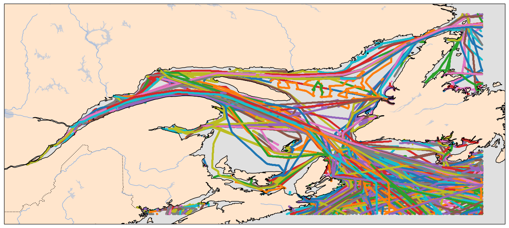

# Embedding with traj2vec

Inspired by word2vec, traj2vec applies the same logic to movement data: instead of predicting the next word, it predicts the next location in a sequence. Just like words gain meaning from context, vessel positions gain meaning from their trajectory history.

The result: trajectories that “look alike” end up close together in embedding space. For instance, two ferries running parallel routes will embed similarly, while a cargo vessel crossing the Gulf of Mexico will sit far away from a fishing boat looping off the coast.<br>

### Imports

```python
import os
import h3
import json
import aisdb
import cartopy.feature as cfeature
import cartopy.crs as ccrs
from aisdb.database.dbconn import PostgresDBConn
from aisdb.denoising_encoder import encode_greatcircledistance, InlandDenoising
from aisdb.track_gen import min_speed_filter, min_track_length_filter
from aisdb.database import sqlfcn
from datetime import datetime, timedelta
from collections import defaultdict
from tqdm import tqdm
import pprint
import numpy as np
import geopandas as gpd
import matplotlib.pyplot as plt

import nest_asyncio
nest_asyncio.apply()
```

#### Processing AIS Tracks into Clean Segments

This function pulls raw AIS data from a database, denoises it, splits tracks into time-consistent segments, filters outliers, and interpolates them at fixed time steps. The result is a set of **clean, continuous vessel trajectories** ready for embedding

```python
def process_interval(dbconn, start, end):
    # Open a new connection with the database
    qry = aisdb.DBQuery(dbconn=dbconn, start=start, end=end,
                        xmin=xmin, ymin=ymin, xmax=xmax, ymax=ymax,
                        callback=aisdb.database.sqlfcn_callbacks.in_bbox_time_validmmsi)
    
    # Decimate is for removing unnecessary points in the trajectory
    rowgen = qry.gen_qry(fcn=sqlfcn.crawl_dynamic_static)
    tracks = aisdb.track_gen.TrackGen(rowgen, decimate=False)

    with InlandDenoising(data_dir='./data/tmp/') as remover:
        cleaned_tracks = remover.filter_noisy_points(tracks)
    
    # Split the tracks based on the time between transmissions
    track_segments = aisdb.track_gen.split_timedelta(cleaned_tracks, time_split)
    
    # Filter out segments that are below the min-score threshold
    tracks_encoded = encode_greatcircledistance(track_segments, distance_threshold=distance_split, speed_threshold=speed_split)
    tracks_encoded = min_speed_filter(tracks_encoded, minspeed=1)

    # Interpolate the segments every five minutes to enforce continuity
    tracks_interpolated = aisdb.interp.interp_time(tracks_encoded, step=timedelta(minutes=1))

    # Returns a generator from a Python variable
    return list(tracks_interpolated)
```

### Loading Region and Grid Shapefiles

We load the study region (Gulf shapefile) and a hexagonal grid (H3 resolution 6). These will be used to map vessel positions into discrete spatial cells — the “tokens” for our trajectory embedding model.

```python
# Load the shapefile
gulf_shapefile = './data/region/gulf.shp'

print(f"Loading shapefile from {gulf_shapefile}...")
gdf_gulf = gpd.read_file(gulf_shapefile)

gdf_hexagons = gpd.read_file('./data/cell/Hexagons_6.shp')
gdf_hexagons = gdf_hexagons.to_crs(epsg=4326)  # Consistent CRS projection
```

Each trajectory is converted from lat/lon coordinates into **H3 hexagon IDs** at resolution 6. To avoid redundant entries, we deduplicate consecutive identical cells while keeping the timestamp of first entry. The result is a sequence of discrete spatial tokens with time information — the input format for traj2vec.

```python
# valid_h3_ids = set(gdf_hexagons['hex_id'])
bounding_box = gdf_hexagons.total_bounds  # Extract the bounding box
# bounding_box = gdf_gulf.total_bounds  # Extract the bounding box
xmin, ymin, xmax, ymax = bounding_box  # Split the bounding box

start_date = datetime(2023, 1, 1)
end_date = datetime(2023, 1, 30)
print(f"Processing trajectories from {start_date} to {end_date}")
# Define pre-processing parameters
time_split = timedelta(hours=3)
distance_split = 10000  # meters
speed_split = 40  # knots

cell_visits = defaultdict(lambda: defaultdict(list))
filtered_visits = defaultdict(lambda: defaultdict(list))
g2h3_vec = np.vectorize(h3.latlng_to_cell)
pp = pprint.PrettyPrinter(indent=4)

track_info_list = []
track_list = process_interval(dbconn, start_date, end_date)
for track in tqdm(track_list, total=len(track_list), desc="Vessels", leave=False):
    h3_ids = g2h3_vec(track['lat'], track['lon'], 6)
    timestamps = track['time']
    # Identify the entry points of cells on a track
    # Deduplicate consecutive identical h3_ids while preserving the entry timestamp
    dedup_h3_ids = [h3_ids[0]]
    dedup_timestamps = [timestamps[0]]
    for i in range(1, len(h3_ids)):
        if h3_ids[i] != dedup_h3_ids[-1]:
            dedup_h3_ids.append(h3_ids[i])
            dedup_timestamps.append(timestamps[i])
    track_info = {
        "mmsi": track['mmsi'],
        "h3_seq": dedup_h3_ids,
        "timestamp_seq": dedup_timestamps
    }
    track_info_list.append(track_info)
```

Before training embeddings, it’s useful to check how long our AIS trajectories are. The function below computes summary statistics (min, max, mean, percentiles) and plots the distribution of track lengths in terms of H3 cells.

_In our dataset, the distribution is skewed to the left — most vessel tracks are relatively short, with only a few very long trajectories._

For a simpler visualization, we also plot trajectories in raw lat/lon space without cartographic features. This is handy for debugging and checking if preprocessing (deduplication, interpolation) worked correctly.

```python
import seaborn as sns

def plot_length_distribution(track_lengths):
    # Compute summary stats
    length_stats = {
        "min": int(np.min(track_lengths)),
        "max": int(np.max(track_lengths)),
        "mean": float(np.mean(track_lengths)),
        "median": float(np.median(track_lengths)),
        "percentiles": {
            "10%": int(np.percentile(track_lengths, 10)),
            "25%": int(np.percentile(track_lengths, 25)),
            "50%": int(np.percentile(track_lengths, 50)),
            "75%": int(np.percentile(track_lengths, 75)),
            "90%": int(np.percentile(track_lengths, 90)),
            "95%": int(np.percentile(track_lengths, 95)),
        }
    }
    print(length_stats)

    # Plot distribution
    plt.figure(figsize=(10, 6))
    sns.histplot(track_lengths, bins=100, kde=True)
    plt.title("Distribution of Track Lengths")
    plt.xlabel("Track Length (number of H3 cells)")
    plt.ylabel("Frequency")
    plt.grid(True)
    plt.tight_layout()
    plt.show()


def map_view(tracks, dot_size=3, color=None, save=False, path=None, bbox=None, line=False, line_width=0.5, line_opacity=0.3):
    fig = plt.figure(figsize=(16, 9))
    ax = plt.axes(projection=ccrs.PlateCarree())

    # Add cartographic features
    ax.add_feature(cfeature.OCEAN.with_scale('10m'), facecolor='#E0E0E0')
    ax.add_feature(cfeature.LAND.with_scale('10m'), facecolor='#FFE5CC')
    ax.add_feature(cfeature.BORDERS, linestyle=':')
    ax.add_feature(cfeature.LAKES, alpha=0.5)
    ax.add_feature(cfeature.RIVERS)
    ax.coastlines(resolution='10m')

    if line:
        for track in tqdm(tracks):
            ax.plot(track['lon'], track['lat'], color=color, linewidth=line_width, alpha=line_opacity, transform=ccrs.PlateCarree())
    else:
        for track in tqdm(tracks):
            ax.scatter(track['lon'], track['lat'], c=color, s=dot_size, transform=ccrs.PlateCarree())

    if bbox:
        # Set the map extent based on a bounding box
        ax.set_extent(bbox, crs=ccrs.PlateCarree())

    ax.gridlines(draw_labels=True)

    if save:
        plt.savefig(path, dpi=300, transparent=True)

    plt.show()


def hex_view(lats, lons, save=True):
    plt.figure(figsize=(8,8))
    for traj_lat, traj_lon in zip(lats, lons):
        plt.plot(traj_lon, traj_lat, alpha=0.3, linewidth=1)

    plt.xlabel("Longitude")
    plt.ylabel("Latitude")
    plt.title("Test Trajectories")
    plt.axis("equal")
    if save:
        plt.savefig("img/test_track.png", dpi=300)
```

&#x20;                                              

&#x20;                                             .png>)

Filtering out some values

```python
track_info_list = [t for t in track_info_list if (len(t['h3_seq']) >= 10)&(len(t['h3_seq']) <= 300)]
```

&#x20;                                             .png>)

We collect all unique H3 IDs from the trajectories and assign each one an integer index. Just like in NLP, we also reserve special tokens for **padding, start, and end of sequence**. This turns spatial cells into a vocabulary that our embedding model can work with.

Each vessel track is then mapped from its H3 sequence into an integer sequence (`int_seq`). We also convert the H3 cells back into lat/lon pairs for later visualization. At this point, the data is ready to be fed into a **traj2vec-style model**.

```python
vec_cell_to_latlng = np.vectorize(h3.cell_to_latlng)

# Extract hex ids from all tracks
all_h3_ids = set()
for track in track_info_list:
    all_h3_ids.update(track['h3_seq'])  # or t['int_seq'] if already mapped

# Build vocab: reserve 0,1,2 for BOS, EOS, PAD
h3_vocab = {h: i+3 for i, h in enumerate(sorted(all_h3_ids))}
# h3_vocab = {h: i+3 for i, h in enumerate(sorted(valid_h3_ids))}
special_tokens = {"<PAD>": 0, "<BOS>": 1, "<EOS>": 2}
h3_vocab.update(special_tokens)

for t in track_info_list:
    t["int_seq"] = [h3_vocab[h] for h in t["h3_seq"] if h in h3_vocab]
    t["lat"], t["lon"] = vec_cell_to_latlng(t.get('h3_seq'))

```

### Train Test Split + Data Saving

We split the cleaned trajectories into **train, validation, and test sets**. This ensures our model can be trained, tuned, and evaluated fairly without data leakage.

Each trajectory is written out in multiple aligned formats:

* **.src** → input sequence (all tokens except last)
* **.trg** → target sequence (all tokens except first)
* **.lat / .lon** → raw geographic coordinates (for visualization)
* **.t** → the complete trajectory sequence

This setup mirrors NLP datasets, where models learn to predict the “next token” in a sequence.

```python
from sklearn.model_selection import train_test_split

# Initial split: train vs temp
train_tracks, temp_tracks = train_test_split(track_info_list, test_size=0.4, random_state=42)
# Second split: validation vs test
val_tracks, test_tracks = train_test_split(temp_tracks, test_size=0.5, random_state=42)

def save_data(tracks, prefix, output_dir="data"):
    os.makedirs(output_dir, exist_ok=True)
    with open(os.path.join(output_dir, f"{prefix}.src"), "w") as f_src, \
         open(os.path.join(output_dir, f"{prefix}.trg"), "w") as f_trg, \
         open(os.path.join(output_dir, f"{prefix}.lat"), "w") as f_lat, \
         open(os.path.join(output_dir, f"{prefix}.lon"), "w") as f_lon, \
         open(os.path.join(output_dir, f"{prefix}_trj.t"), "w") as f_t:

        for idx, t in enumerate(tracks):
            ids = t["int_seq"]
            src = ids[:-1]
            trg = ids[1:]
            
            f_t.write(" ".join(map(str, ids)) + "\n")   # the whole track, t = src U trg
            f_src.write(" ".join(map(str, src)) + "\n")
            f_trg.write(" ".join(map(str, trg)) + "\n")
            f_lat.write(" ".join(map(str, t.get('lat'))) + "\n")
            f_lon.write(" ".join(map(str, t.get('lon'))) + "\n")

def save_h3_vocab(h3_vocab, output_dir="data", filename="vocab.json"):
    os.makedirs(output_dir, exist_ok=True)
    with open(os.path.join(output_dir, filename), "w") as f:
        json.dump(h3_vocab, f, indent=2)
        
        
save_data(train_tracks, "train")
save_data(val_tracks, "val")
save_data(test_tracks, "test")
save_h3_vocab(h3_vocab) # save the INT index mapping to H3 index

lats = [np.fromstring(line, sep=' ') for line in open("data/train.lat")]
lons = [np.fromstring(line, sep=' ') for line in open("data/train.lon")]

hex_view(lats, lons)
```


&#x20;                                              .png>)

### Some Other Imports for Training

```python
import os
import numpy as np

import torch
import torch.nn as nn
from torch.nn.utils import clip_grad_norm_
# from torch.nn.utils.rnn import pack_padded_sequence, pad_packed_sequence
from torch.utils.tensorboard import SummaryWriter

# from funcy import merge
import time, os, shutil, logging, h5py
# from collections import namedtuple

from model.t2vec import EncoderDecoder
from data_loader import DataLoader
from utils import *
from model.loss import *

writer = SummaryWriter()

PAD = 0
BOS = 1
EOS = 2
```

### Training Loop Setup

We set up utility functions to initialize model weights, save checkpoints during training, and run validation. These ensure training is reproducible and models can be restored later.\
\
The `train()` function loads train/val datasets, defines the loss functions (negative log-likelihood or KL-divergence), and builds the encoder-decoder model with its optimizer and scheduler. If a checkpoint exists, training resumes from where it left off; otherwise, parameters are freshly initialized.

#### Generative + Discriminative Losses

Training uses two objectives:

* **Generative loss** (predicting the next trajectory cell, like word prediction in NLP).
* **Discriminative loss** (triplet margin loss, ensuring embeddings of similar trajectories are close while different ones are far apart).

These combined losses help the model learn not only to generate realistic trajectories but also to embed them in a useful vector space.

The loop runs over iterations, logging training progress, validating periodically, and saving checkpoints. A learning rate scheduler adjusts the optimizer based on validation loss, and early stopping prevents wasted computation when no improvements occur.

The `test()` function loads the best checkpoint, evaluates it on the test set, and reports **average loss** and **perplexity**. Perplexity is borrowed from NLP — lower values mean the model is more confident in predicting the next trajectory cell.

```python
def init_parameters(model):
    for p in model.parameters():
        p.data.uniform_(-0.1, 0.1)

def savecheckpoint(state, is_best, args):
    torch.save(state, args.checkpoint)
    if is_best:
        shutil.copyfile(args.checkpoint, os.path.join(args.data, 'best_model.pt'))

def validate(valData, model, lossF, args):
    """
    valData (DataLoader)
    """
    m0, m1 = model
    ## switch to evaluation mode
    m0.eval()
    m1.eval()

    num_iteration = valData.size // args.batch
    if valData.size % args.batch > 0: num_iteration += 1

    total_genloss = 0
    for iteration in range(num_iteration):
        gendata = valData.getbatch_generative()
        with torch.no_grad():
            genloss = genLoss(gendata, m0, m1, lossF, args)
            total_genloss += genloss.item() * gendata.trg.size(1)
    ## switch back to training mode
    m0.train()
    m1.train()
    return total_genloss / valData.size


def train(args):
    logging.basicConfig(filename=os.path.join(args.data, "training.log"), level=logging.INFO)

    trainsrc = os.path.join(args.data, "train.src") # data path
    traintrg = os.path.join(args.data, "train.trg")
    trainlat = os.path.join(args.data, "train.lat")
    trainlon = os.path.join(args.data, "train.lon")
    # trainmta = os.path.join(args.data, "train.mta")
    trainData = DataLoader(trainsrc, traintrg, trainlat, trainlon, args.batch, args.bucketsize)
    print("Reading training data...")
    trainData.load(args.max_num_line)
    print("Allocation: {}".format(trainData.allocation))
    print("Percent: {}".format(trainData.p))

    valsrc = os.path.join(args.data, "val.src")
    valtrg = os.path.join(args.data, "val.trg")
    vallat = os.path.join(args.data, "val.lat")
    vallon = os.path.join(args.data, "val.lon")
    if os.path.isfile(valsrc) and os.path.isfile(valtrg):
        valData = DataLoader(valsrc, valtrg, vallat, vallon, args.batch, args.bucketsize, validate=True)
        print("Reading validation data...")
        valData.load()
        assert valData.size > 0, "Validation data size must be greater than 0"
        print("Loaded validation data size {}".format(valData.size))
    else:
        print("No validation data found, training without validating...")

    ## create criterion, model, optimizer
    if args.criterion_name == "NLL":
        criterion = NLLcriterion(args.vocab_size)
        lossF = lambda o, t: criterion(o, t)
    else:
        assert os.path.isfile(args.knearestvocabs),\
            "{} does not exist".format(args.knearestvocabs)
        print("Loading vocab distance file {}...".format(args.knearestvocabs))
        with h5py.File(args.knearestvocabs, "r") as f:
            V, D = f["V"][...], f["D"][...]
            V, D = torch.LongTensor(V), torch.FloatTensor(D)
        D = dist2weight(D, args.dist_decay_speed)
        if args.cuda and torch.cuda.is_available():
            V, D = V.cuda(), D.cuda()
        criterion = KLDIVcriterion(args.vocab_size)
        lossF = lambda o, t: KLDIVloss(o, t, criterion, V, D)
    triplet_loss = nn.TripletMarginLoss(margin=1.0, p=2)

    m0 = EncoderDecoder(args.vocab_size,
                        args.embedding_size,
                        args.hidden_size,
                        args.num_layers,
                        args.dropout,
                        args.bidirectional)
    m1 = nn.Sequential(nn.Linear(args.hidden_size, args.vocab_size),
                       nn.LogSoftmax(dim=1))
    if args.cuda and torch.cuda.is_available():
        print("=> training with GPU")
        m0.cuda()
        m1.cuda()
        criterion.cuda()
        #m0 = nn.DataParallel(m0, dim=1)
    else:
        print("=> training with CPU")

    m0_optimizer = torch.optim.Adam(m0.parameters(), lr=args.learning_rate)
    m1_optimizer = torch.optim.Adam(m1.parameters(), lr=args.learning_rate)

    scheduler = torch.optim.lr_scheduler.ReduceLROnPlateau(
        m0_optimizer,
        mode='min',
        patience=args.lr_decay_patience,
        min_lr=0,
        verbose=True
    )

    ## load model state and optmizer state
    if os.path.isfile(args.checkpoint):
        print("=> loading checkpoint '{}'".format(args.checkpoint))
        logging.info("Restore training @ {}".format(time.ctime()))
        checkpoint = torch.load(args.checkpoint)
        args.start_iteration = checkpoint["iteration"]
        best_prec_loss = checkpoint["best_prec_loss"]
        m0.load_state_dict(checkpoint["m0"])
        m1.load_state_dict(checkpoint["m1"])
        m0_optimizer.load_state_dict(checkpoint["m0_optimizer"])
        m1_optimizer.load_state_dict(checkpoint["m1_optimizer"])
    else:
        print("=> no checkpoint found at '{}'".format(args.checkpoint))
        logging.info("Start training @ {}".format(time.ctime()))
        best_prec_loss = float('inf')
        args.start_iteration = 0
        print("=> initializing the parameters...")
        init_parameters(m0)
        init_parameters(m1)
        ## here: load pretrained wrod (cell) embedding

    num_iteration = 6700*128 // args.batch
    print("Iteration starts at {} "
          "and will end at {}".format(args.start_iteration, num_iteration-1))
    
    no_improvement_count = 0

    ## training
    for iteration in range(args.start_iteration, num_iteration):
        try:
            m0_optimizer.zero_grad()
            m1_optimizer.zero_grad()
            ## generative loss
            gendata = trainData.getbatch_generative()
            genloss = genLoss(gendata, m0, m1, lossF, args)
            ## discriminative loss
            disloss_cross, disloss_inner = 0, 0
            if args.use_discriminative and iteration % 5 == 0:
                a, p, n = trainData.getbatch_discriminative_cross()
                disloss_cross = disLoss(a, p, n, m0, triplet_loss, args)
                a, p, n = trainData.getbatch_discriminative_inner()
                disloss_inner = disLoss(a, p, n, m0, triplet_loss, args)
            loss = genloss + args.discriminative_w * (disloss_cross + disloss_inner)

            # Add to tensorboard
            writer.add_scalar('Loss/train', loss, iteration)

            ## compute the gradients
            loss.backward()
            ## clip the gradients
            clip_grad_norm_(m0.parameters(), args.max_grad_norm)
            clip_grad_norm_(m1.parameters(), args.max_grad_norm)
            ## one step optimization
            m0_optimizer.step()
            m1_optimizer.step()
            ## average loss for one word
            avg_genloss = genloss.item() / gendata.trg.size(0)

            if iteration % args.print_freq == 0:
                print("Iteration: {0:}\tGenerative Loss: {1:.3f}\t"\
                      "Discriminative Cross Loss: {2:.3f}\tDiscriminative Inner Loss: {3:.3f}"\
                      .format(iteration, avg_genloss, disloss_cross, disloss_inner))
            
            if iteration % args.save_freq == 0 and iteration > 0:
                prec_loss = validate(valData, (m0, m1), lossF, args)

                # Add to tensorboard
                writer.add_scalar('Loss/validation', prec_loss, iteration)

                scheduler.step(prec_loss)
                if prec_loss < best_prec_loss:
                    best_prec_loss = prec_loss
                    logging.info("Best model with loss {} at iteration {} @ {}"\
                                 .format(best_prec_loss, iteration, time.ctime()))
                    is_best = True
                    no_improvement_count = 0
                else:
                    is_best = False
                    no_improvement_count += 1

                print("Saving the model at iteration {} validation loss {}"\
                      .format(iteration, prec_loss))
                savecheckpoint({
                    "iteration": iteration,
                    "best_prec_loss": best_prec_loss,
                    "m0": m0.state_dict(),
                    "m1": m1.state_dict(),
                    "m0_optimizer": m0_optimizer.state_dict(),
                    "m1_optimizer": m1_optimizer.state_dict()
                }, is_best, args)

                # Early stopping if there is no improvement after a certain number of epochs
                if no_improvement_count >= args.early_stopping_patience:
                    print('No improvement after {} iterations, early stopping triggered.'.format(args.early_stopping_patience))
                    break
                
        except KeyboardInterrupt:
            break


def test(args):
    # load testing data
    testsrc = os.path.join(args.data, "test.src")
    testtrg = os.path.join(args.data, "test.trg")
    testlat = os.path.join(args.data, "test.lat")
    testlon = os.path.join(args.data, "test.lon")
    if os.path.isfile(testsrc) and os.path.isfile(testtrg):
        testData = DataLoader(testsrc, testtrg, testlat, testlon, args.batch, args.bucketsize, validate=True)
        print("Reading testing data...")
        testData.load()
        assert testData.size > 0, "Testing data size must be greater than 0"
        print("Loaded testing data size {}".format(testData.size))
    else:
        print("No testing data found, aborting test.")
        return

    # set up model
    m0 = EncoderDecoder(args.vocab_size,
                        args.embedding_size,
                        args.hidden_size,
                        args.num_layers,
                        args.dropout,
                        args.bidirectional)
    m1 = nn.Sequential(nn.Linear(args.hidden_size, args.vocab_size),
                       nn.LogSoftmax(dim=1))

    # load best model state
    best_model_path = 'data/best_model.pt'
    if os.path.isfile(best_model_path):
        print("=> loading checkpoint '{}'".format(args.checkpoint))
        best_model = torch.load(best_model_path)
        m0.load_state_dict(best_model["m0"])
        m1.load_state_dict(best_model["m1"])
    else:
        print("Best model not found. Aborting test.")
        return

    m0.eval()
    m1.eval()

    # loss function
    criterion = NLLcriterion(args.vocab_size)
    lossF = lambda o, t: criterion(o, t)

    # check device
    if args.cuda and torch.cuda.is_available():
        print("=> test with GPU")
        m0.cuda()
        m1.cuda()
        criterion.cuda()
        #m0 = nn.DataParallel(m0, dim=1)
    else:
        print("=> test with CPU")

    num_iteration = (testData.size + args.batch - 1) // args.batch
    total_genloss = 0
    total_tokens = 0

    with torch.no_grad():
        for iter in range(num_iteration):
            gendata = testData.getbatch_generative()
            genloss = genLoss(gendata, m0, m1, lossF, args)
            total_genloss += genloss.item() #* gendata.trg.size(1) # remove the multiplication
            total_tokens += (gendata.trg != PAD).sum().item() # count non-pad tokens
            print("Testing genloss at {} iteration is {}".format(iter, total_genloss))
        
    avg_loss = total_genloss / total_tokens
    perplexity = torch.exp(torch.tensor(avg_loss))

    print(f"[Test] Avg Loss: {avg_loss:.4f} | Perplexity: {perplexity:.2f}")

```

ARGS

```python
class Args:
    data = 'data/'
    checkpoint = 'data/checkpoint.pt'
    vocab_size = len(h3_vocab)
    embedding_size = 128
    hidden_size = 128
    num_layers = 1
    dropout = 0.1
    max_grad_norm = 1.0
    learning_rate = 1e-2
    lr_decay_patience = 20
    early_stopping_patience = 50
    cuda = torch.cuda.is_available()
    bidirectional = True
    batch = 16
    num_epochs = 100
    bucketsize = [(20,30),(30,30),(30,50),(50,50),(50,70),(70,70),(70,100),(100,100)]
    criterion_name = "NLL"
    use_discriminative = True
    discriminative_w = 0.1
    max_num_line = 200000
    start_iteration = 0
    generator_batch = 16
    print_freq = 10
    save_freq = 10


args = Args()
```

```python
train(args)
```

Test

```python
test(args)
```

Results-&#x20;

The generative model’s performance on the test dataset demonstrates remarkable accuracy in predicting vessel trajectories. Over the course of the evaluation, the cumulative generative loss across batches increased steadily, reflecting the accumulation of prediction errors over the sequences. When aggregated and normalized per token, the average loss was **0.2309**, corresponding to a **perplexity of approximately 1.26**.

Perplexity is a standard measure in sequence modeling that quantifies how well a probabilistic model predicts a sequence of tokens. A perplexity close to 1 indicates near-deterministic prediction, meaning that the model assigns very high probability to the correct next token in the sequence. In the context of vessel trajectories, this result implies that the model is extremely confident and precise in forecasting the next H3 cell in a track, capturing the underlying spatial and temporal patterns in the data.

These results are particularly noteworthy because vessel movements are constrained by both geography and navigational behavior. The model effectively learns these patterns, predicting transitions between cells with minimal uncertainty. Achieving such a low perplexity confirms that the preprocessing pipeline, H3 cell encoding, and the sequence modeling architecture are all functioning harmoniously, enabling highly accurate trajectory modeling.

Overall, the evaluation demonstrates that the model not only generalizes well to unseen tracks but also reliably captures the deterministic structure of vessel movement, providing a robust foundation for downstream tasks such as trajectory prediction, anomaly detection, or maritime route analysis.

```
Testing genloss at 0 iteration is 46.40993881225586
Testing genloss at 1 iteration is 83.17555618286133
Testing genloss at 2 iteration is 122.76013565063477
Testing genloss at 3 iteration is 167.81907272338867
Testing genloss at 4 iteration is 223.75146102905273
Testing genloss at 5 iteration is 287.765926361084
Testing genloss at 6 iteration is 328.6252250671387
Testing genloss at 7 iteration is 394.95031356811523
Testing genloss at 8 iteration is 459.411678314209
Testing genloss at 9 iteration is 557.8198432922363
Testing genloss at 10 iteration is 724.5464973449707
Testing genloss at 11 iteration is 876.1395149230957
Testing genloss at 12 iteration is 1020.6461372375488
Testing genloss at 13 iteration is 1277.3499336242676
Testing genloss at 14 iteration is 1416.0101203918457
Testing genloss at 15 iteration is 1742.3399543762207
Testing genloss at 16 iteration is 2101.4984016418457
Testing genloss at 17 iteration is 2319.603458404541
[Test] Avg Loss: 0.2309 | Perplexity: 1.26
```
