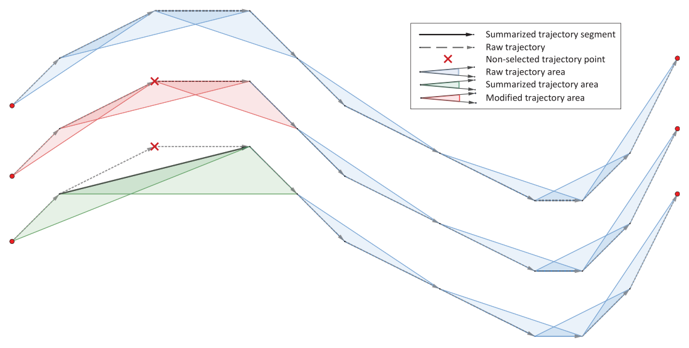

# 📐 Decimation with AISdb

Automatic Identification System (AIS) data provides a wealth of insights into maritime activities, including vessel movements and traffic patterns. However, the massive volume of AIS data, often consisting of millions or even billions of GPS position points, can be overwhelming somehow. Processing and visualizing this raw data directly can be computationally expensive, slow, and difficult to interpret.

This is where the AISdb's **decimation** comes into play - it helps users efficiently reduce data clutter, making it easier to extract and focus on the most relevant information.

## What is Decimation in the Context of AIS Tracks? <a href="#what-is-decimation-in-the-context-of-ais-tracks" id="what-is-decimation-in-the-context-of-ais-tracks"></a>

Decimation, in simple terms, means reducing the number of data points. When applied to AIS tracks, it involves selectively removing GPS points from a vessel’s trajectory while preserving its overall shape and key characteristics. Rather than processing every recorded position, decimation algorithms identify and retain the most relevant points, optimizing data efficiency without significant loss of accuracy.

Think of it like simplifying a drawing: instead of using thousands of tiny dots to represent a complex image, you can use fewer, strategically chosen points to capture its essence. Similarly, decimation ensures that a vessel’s path with fewer points while maintaining its core trajectory, making analysis and visualization more efficient.

## Why Decimate AIS Data? <a href="#why-decimate-ais-data" id="why-decimate-ais-data"></a>

There are several key benefits for using decimation techniques when working with AIS data:

1. **Improved Performance and Efficiency**: Reducing the number of data points can dramatically decrease the computational load, enabling faster analyses, quicker visualizations, and more effective workflow, especially when dealing with large datasets.
2. **Clearer Visualizations**: Dense tracks can clutter visualizations and make it difficult to interpret the data. Decimation simplifies the tracks, emphasizing on significant movements and patterns for more intuitive analysis.
3. **Noise Reduction**: While decimation is not designed as a noise removal technique, it can help smooth out minor inaccuracies and high-frequency fluctuations from raw GPS data. This can be useful for focusing on broader trends and vessel movements.

## AISdb and `simplify_linestring_idx()` <a href="#aisdb-and-simplify_linestring_idx-your-decimation-tool" id="aisdb-and-simplify_linestring_idx-your-decimation-tool"></a>

In AISDB, `TrackGen()` method includes a`decimate` parameter that, when set as `True`,  triggers the `simplify_linestring_idx(x, y, precision)`function. This function uses the [**Visvalingam-Whyatt algorithm**](https://en.wikipedia.org/wiki/Visvalingam%E2%80%93Whyatt_algorithm) to simplify vessel tracks while preserving key trajectory details.

## **How the Visvalingam-Whyatt Algorithm Works**

The Visvalingam-Whyatt algorithm is an approach to line simplification. It works by removing points that contribute the least to the overall shape of the line. Here’s how it works:

* The algorithm measures the importance of a point by calculating the area of the triangle formed by that point and its adjacent points.
* Points on relatively straight segments form smaller triangles, meaning they’re less important in defining the shape.
* Points at curves and corners form larger triangles, signaling that they’re crucial for maintaining the line’s characteristic form.

The algorithm iteratively removes the points with the smallest triangle areas until the desired level of simplification is achieved. In AISdb, this process is controlled by the `decimate` parameter in the `TrackGen()` method.

### Using `TrackGen(...,decimate = True)` with AISDB Tracks <a href="#using-trackgen...decimate--true-with-aisdb-tracks" id="using-trackgen...decimate--true-with-aisdb-tracks"></a>

Below is a conceptual Python example that demonstrates how to apply decimation to AIS tracks:

```python
import aisdb
import numpy as np

# Assuming you have a database connection and domain set up as described
with aisdb.SQLiteDBConn(dbpath='your_ais_database.db') as dbconn:
    qry = aisdb.DBQuery(
        dbconn=dbconn,
        start='2023-01-01', end='2023-01-02',  # Example time range
        xmin=-10, xmax=0, ymin=40, ymax=50,    # Example bounding box
        callback=aisdb.database.sqlfcn_callbacks.in_validmmsi_bbox,
    )

    simplified_tracks = aisdb.TrackGen(qry.gen_qry(), decimate=True)  # Generate initial tracks 

    for segment in simplified_tracks:
        print(f"Simplified track for MMSI: {segment['mmsi']}, Points: {segment['lon'].size}")

```

## Using `simplify_linestring_idx()` with AISDB Tracks

To get more control over the precision for decimation, use function: `simplify_linestring_idx` in AISdb.

```python
import aisdb
import numpy as np

# Assuming you have a database connection and domain set up as described
with aisdb.SQLiteDBConn(dbpath='your_ais_database.db') as dbconn:
    qry = aisdb.DBQuery(
        dbconn=dbconn,
        start='2023-01-01', end='2023-01-02',  # Example time range
        xmin=-10, xmax=0, ymin=40, ymax=50,    # Example bounding box
        callback=aisdb.database.sqlfcn_callbacks.in_validmmsi_bbox,
    )

    tracks = aisdb.TrackGen(qry.gen_qry(), decimate=False)  # Generate initial tracks

    simplified_tracks = []

    for track in tracks:
        if track['lon'].size > 2:  # Ensure track has enough points
            # Apply decimation using simplify_linestring_idx
            simplified_indices = aisdb.track_gen.simplify_linestring_idx(
                track['lon'], track['lat'], precision=0.01  # Example precision
            )
            # Extract simplified track points
            simplified_track = {
                'mmsi': track['mmsi'],
                'time': track['time'][simplified_indices],
                'lon': track['lon'][simplified_indices],
                'lat': track['lat'][simplified_indices],
                # Carry over other relevant track attributes as needed
            }
            simplified_tracks.append(simplified_track)
        else:
            simplified_tracks.append(track)  # Keep tracks with few points as is

    # Now 'simplified_tracks' contains decimated tracks ready for further analysis
    for segment in simplified_tracks:
        print(f"Simplified track for MMSI: {segment['mmsi']}, Points: {segment['lon'].size}")

```

### Illustration of Decimation <a href="#key-parameters-and-usage-notes" id="key-parameters-and-usage-notes"></a>

<figure><figcaption><p><a href="decimation-with-aisdb.md#references">(Amigo et al., 2021)</a></p></figcaption></figure>

### Key Parameters and Usage Notes: <a href="#key-parameters-and-usage-notes" id="key-parameters-and-usage-notes"></a>

* **Precision**: The `precision` parameter controls the level of simplification. A smaller value (e.g., 0.001) results in more retained points and higher fidelity, while a larger value (e.g., 0.1) simplifies the track further with fewer points.
* **x, y**: These are NumPy arrays representing the longitude and latitude coordinates of the track points.
* **TrackGen Integration**: Decimation is applied after generating tracks with `aisdb.TrackGen`, followed by the application of `simplify_linestring_idx()` to each track individually.
* **Iterative Refinement**: Decimation is often an iterative process. You may need to visualize the decimated tracks, assess the level of simplification, and adjust the `precision` to balance simplification with data fidelity.

## Conclusion <a href="#embrace-the-power-of-less" id="embrace-the-power-of-less"></a>

Decimation is a powerful tool for simplifying and decluttering AIS data. By intelligently reducing the data’s complexity, AISDB’s `simplify_linestring_idx()` and `TrackGen()`allows you to process data more efficiently, create clearer visualizations, and gain deeper insights from your maritime data. Experiment with different precision values, and discover how “less” data can lead to “more” meaningful results in your AIS analysis workflows!

## References

1. Amigo D, Sánchez Pedroche D, García J, Molina JM. Review and classification of trajectory summarisation algorithms: From compression to segmentation. International Journal of Distributed Sensor Networks. 2021;17(10). doi:[10.1177/15501477211050729](https://doi.org/10.1177/15501477211050729)
