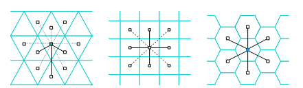

# Hexagon Discretization

## Introduction

Hexagonal Geospatial Indexing (H3): Uber’s hierarchical hexagonal geospatial indexing system, partitions
&#x20;the Earth into a multi-resolution hexagonal grid. Its key
&#x20;advantage over square grids is the “one-distance rule,” where
&#x20;all neighbors of a hexagon lie at comparable step distances.

<figure><figcaption></figcaption></figure>

As illustrated in the figure above, this uniformity removes the diagonal-versus-edge ambiguity present in square lattices. For maritime work, hexagons are great because they reduce directional bias and make neighborhood queries and aggregation intuitive.&#x20;

> Note: H3 indexes are 64-bit IDs typically shown as hex strings like “860e4d31fffffff.”

### Discretize AIS Lat/Lon points to hexagons using AISDb

The code below provides a complete example of how to connect to a database of AIS data using AISDb and generate the corresponding H3 index for each data point.

```python
import aisdb
from aisdb import DBQuery
from aisdb.database.dbconn import PostgresDBConn
from datetime import datetime, timedelta
from aisdb.discretize.h3 import Discretizer  # main import to convert lat/lon to H3 indexes

# >>> PostgreSQL connection details (replace placeholders or use environment variables) <<<
db_user = '<>'            # PostgreSQL username
db_dbname = '<>'          # PostgreSQL database/schema name
db_password = '<>'        # PostgreSQL password
db_hostaddr = '127.0.0.1' # PostgreSQL host (localhost shown)

# Create a database connection handle for AISDB to use
dbconn = PostgresDBConn(
    port=5555,            # PostgreSQL port (5432 is default; 5555 here is just an example)
    user=db_user,         # username for authentication
    dbname=db_dbname,     # database/schema to connect to
    host=db_hostaddr,     # host address or DNS name
    password=db_password, # password for authentication
)

# ------------------------------
# Define the spatial and temporal query window
# Note: bbox is [xmin, ymin, xmax, ymax] in lon/lat; variables below help readability
xmin, ymin, xmax, ymax = -70, 45, -58, 53
gulf_bbox = [xmin, xmax, ymin, ymax]  # optional helper; not used directly below

start_time = datetime(2023, 8, 1)     # query start (inclusive)
end_time   = datetime(2023, 8, 2)     # query end (exclusive or inclusive per DB settings)

# Build a query that streams AIS rows in the time window and bounding box
qry = DBQuery(
    dbconn=dbconn,
    start=start_time, end=end_time,
    xmin=xmin, xmax=xmax, ymin=ymin, ymax=ymax,
    # Callback filters rows by time, bbox, and ensures MMSI validity (helps remove junk)
    callback=aisdb.database.sqlfcn_callbacks.in_time_bbox_validmmsi
)

# Prepare containers/generators for streamed processing (memory-efficient)
ais_tracks = []          # placeholder list if you want to collect tracks (unused below)
rowgen = qry.gen_qry()   # generator that yields raw AIS rows from the database

# ------------------------------
# Instantiate the H3 Discretizer at a chosen resolution
# Resolution 6 ≈ regional scale hexagons; increase for finer grids, decrease for coarser grids
# Note: variable name 'descritizer' is kept to match the original snippet (typo is harmless)
descritizer = Discretizer(resolution=6)

# Build tracks from rows; decimate=True reduces oversampling and speeds up processing
tracks = aisdb.track_gen.TrackGen(rowgen, decimate=True)

# Optionally split long tracks into time-bounded segments (e.g., 4-week chunks)
# Useful for chunked processing or time-based aggregation; not used further in this snippet
tracks_segment = aisdb.track_gen.split_timedelta(
    tracks,
    timedelta(weeks=4)
)

# Discretize each track: adds an H3 index array aligned with lat/lon points for that track
# Each yielded track will have keys like 'lat', 'lon', and 'h3_index'
tracks_with_indexes = descritizer.yield_tracks_discretized_by_indexes(tracks)

# Example (optional) usage:
# for t in tracks_with_indexes:
#     # Access the first point's H3 index for this track
#     print(t['mmsi'], t['timestamp'][0], t['lat'][0], t['lon'][0], t['h3_index'][0])
#     break

# Output: H3 Index for lat 50.003334045410156, lon -66.76000213623047: 860e4d31fffffff
```

Refer to the example notebook here: [https://github.com/AISViz/AISdb/blob/master/examples/discretize.ipynb](https://github.com/AISViz/AISdb/blob/master/examples/discretize.ipynb)

## References

1. [https://www.uber.com/en-CA/blog/h3/](https://www.uber.com/en-CA/blog/h3/)
